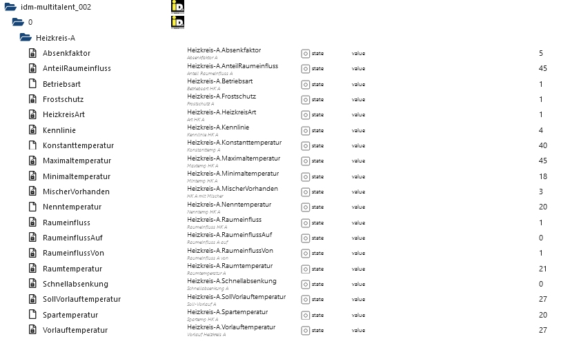
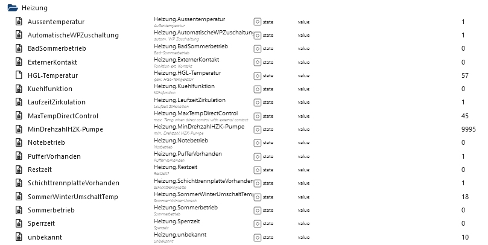
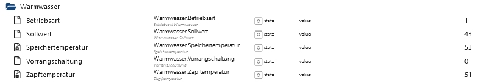
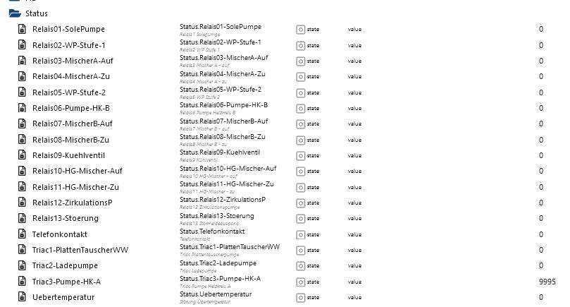

**Attention!** 
This is an open source adapter from an individual that is not related to the manufacturer, no warranty or guarantees! 

IDM agreed to the publishing of this work.

***You might loose warranty from the manufacturer!***
# ioBroker.idm-multitalent_002
[](https://www.npmjs.com/package/iobroker.idm-multitalent_002)
[](https://www.npmjs.com/package/iobroker.idm-multitalent_002)


[](https://nodei.co/npm/iobroker.idm-multitalent_002/)

**Tests:** 

## idm-multitalent_002 adapter for ioBroker
Read sensor data and read and write settings of a iDM heatpump with multitalent.002 control.

Currently following versions are supported (if your version is not listed but you are interested please contact me):
| SW Name | ID in firmware | status |
| :------ | :------------- | :----- |
| TERRA050701 | idm701 (idm701100) | supported, one installation |
| TERRA061001 | idm712 (idm712100) | supported, one installation |
| EVR-070110 | idm722 (idm722100) | supported, one installation |
| EVR-II071102 | idm750 (idm750100) | experimentally, no known installation, issues with data definitions |
| EVR-II100201 | EVR752 (EVR752101) | support in development currently, one experimental installation |
| TERRA130601 | S_H726 (S_H726100) | supported, one installation |

You need a Ethernet to RS422 converter to connect to the multitalent control.
**Note** that you have to connect ground/shield of your converter to the ground of the control/heatpump in order to prevent electric influences on the sensor readings.
There are sensor values and settings values. During a cycle all sensor values and one part of the settings values are read. So the sensor values are read more frequently than the settings values. 
The changed values are transferred immediately.
Note that settings of the heatpump are only read all ~5-6 cycles, so when setting values the acknowledgment might take some time.

During bootup of the heatpump control (e.g. after a power loss) no values should be polled. This is currently **NOT** ensured by the adapter. So you **manually** need to **stop** it. If the control of the heatpump did not start due to the adapter then simply stop the adapter and power cycle the control. This should fix the problem. Afterwards you can start the adapter again. I implemented a delayed switch-on of the serial server. This also mitigates the problem.

Example installation:


Settings of the serial adapter:
```
 Baud Rate(bps) 19200
 Parity         Even
 Data Bit       8
 Stop Bit       1
 Flow Control   None
 UART FIFO      Disable
```

Example screenshots of objects:





## Changelog
### 1.2.9 (2026-09-05)
* (zloe) switch npm deploy from the retired classic npm token to Trusted Publishing (OIDC) - both 1.2.7 and 1.2.8 failed to publish to npm because of this

### 1.2.8 (2026-09-05)
* (zloe) fix repository checker issues (#298): add engines.node, German news translations, correct js-controller/admin dependency versions, add missing tier/licenseInformation, remove deprecated common.main/title, fix broken vscode schema link
* (zloe) add .releaseconfig.json so io-package.json's version is kept in sync automatically on release
* (zloe) fix broken `npm run lint` (missing @eslint/js dependency)

### 1.2.7 (2026-09-05)
* (zloe) fix broken test/lint toolchain (incompatible chai/sinon-chai/chai-as-promised versions, outdated tsconfig moduleResolution)
* (zloe) fix three duplicate `function` numbers in data block definitions that could have targeted the wrong register once made writable
* (zloe) clear all pending communication timers on adapter unload, not just reconnect/resend
* (zloe) remove unused imports, clear the default TCP server IP placeholder
* (zloe) add real unit tests for idm-utils and the main.js communication state machine

### 1.2.6 (2024-09-21)
* (zloe) fixed reconnect handling

### 1.2.5 (2024-01-21)
* (zloe) further fixes in error handling

### 1.2.4 (2024-01-21)
* (zloe) further improve logging and handling of transmission errors

### 1.2.3 (2024-01-21)
* (zloe) improve handling of data transmission problems

### 1.2.2 (2024-01-21)
* (zloe) fix handling of data transmission problems which lead to stopping requesting data

### 1.2.1 (2024-01-20)
* (zloe) improving statistics and log messages
* (zloe) fix data definition for idm722100

### 1.2.0 (2024-01-19)
* (zloe) adding support for idm722100

### 1.1.1 (2023-11-04)
* (zloe) optimizing protocol
* (zloe) updated dependencies

### 1.1.0 (2023-11-02)
* (zloe) initial version TERRA130601 - S_H726100 support
* (zloe) updated dependencies

## License
MIT License

Copyright (c) 2026 zloe <klaus@zloebl.net>

Permission is hereby granted, free of charge, to any person obtaining a copy
of this software and associated documentation files (the "Software"), to deal
in the Software without restriction, including without limitation the rights
to use, copy, modify, merge, publish, distribute, sublicense, and/or sell
copies of the Software, and to permit persons to whom the Software is
furnished to do so, subject to the following conditions:

The above copyright notice and this permission notice shall be included in all
copies or substantial portions of the Software.

THE SOFTWARE IS PROVIDED "AS IS", WITHOUT WARRANTY OF ANY KIND, EXPRESS OR
IMPLIED, INCLUDING BUT NOT LIMITED TO THE WARRANTIES OF MERCHANTABILITY,
FITNESS FOR A PARTICULAR PURPOSE AND NONINFRINGEMENT. IN NO EVENT SHALL THE
AUTHORS OR COPYRIGHT HOLDERS BE LIABLE FOR ANY CLAIM, DAMAGES OR OTHER
LIABILITY, WHETHER IN AN ACTION OF CONTRACT, TORT OR OTHERWISE, ARISING FROM,
OUT OF OR IN CONNECTION WITH THE SOFTWARE OR THE USE OR OTHER DEALINGS IN THE
SOFTWARE.

## Installation
As the adapter is not (yet) listed in the official ioBroker repository you have to download the tgz file from here (github or npmjs).
1. Upload the file to your ioBroker host
1. Install it locally (The paths are different on Windows):
    ```bash
    cd /opt/iobroker
    npm i /path/to/tarball.tgz
    ```

## Developer manual
The serial protocol itself was reverse-engineered (RS422 sniffing, no official iDM documentation exists) mainly by user "makki" in the [KNX-User-Forum "idm Wärmepumpe" thread](https://knx-user-forum.de/forum/%C3%B6ffentlicher-bereich/knx-eib-forum/1251-idm-w%C3%A4rmepumpe) and refined further here; see also the [ioBroker adapter thread](https://forum.iobroker.net/topic/54253/test-adapter-idm-multitalent_002). Neither source documents official min/max limits for the writable values (see below) - they only cover which register a value lives in and how it is encoded.

### Data block definitions
The register/data-block layout for every supported control version (which fields exist, at which position, with which factor/length, and whether they may be written) lives in [`lib/idm_datablocks.default.json`](lib/idm_datablocks.default.json), **not** in the adapter's code. `lib/idm_datablocks.js` only loads and validates it. Each field entry looks like this:

```json
{ "statename": "Heizkreis-A.Betriebsart", "field": "betrieb_A", "description": "Betriebsart HK A", "length": 2, "factor": 1, "writable": true, "function": 11, "min": 0, "max": 5 }
```

* `statename` - the ioBroker state created for this field (empty for padding/unused positions)
* `field` - internal field name (only used for `# was function: X` style comments/debugging)
* `function` - the register id the multitalent control uses to identify this value; must be unique within its data block (checked by `idm_datablocks.js`'s validation - a collision has previously caused a write meant for one field to land on another, see the 1.2.7 changelog entry)
* `length` - 1 or 2 bytes on the wire
* `factor` - raw value is divided/multiplied by this to get/set the real-world value
* `writable` - whether the adapter subscribes to this state and sends changes back to the heat pump
* `min`/`max` - optional. When present, a write outside this range is rejected (logged, never sent to the heat pump, and the displayed value is reverted) instead of being forwarded. **Only a handful of fields have these set** - the enum ranges for the various "Betriebsart" (operating mode) fields, sourced directly from comments already in the codebase. Every other writable field (mostly temperature setpoints) intentionally has no configured limit, because no verified hardware range is available; see the note at the top of the JSON file itself (`_readme` key).

### Overriding the data blocks without an adapter update
The instance setting **"Custom data blocks file"** (`native.dataBlocksFile`) can point to an absolute path to your own JSON file with the same shape as `idm_datablocks.default.json`. If it exists and passes the same validation, it is used instead of the bundled file - useful for adding min/max limits you have verified for your own installation, fixing a field, or adding a not-yet-supported control version, all without reinstalling or upgrading the adapter. A file that fails validation (or can't be read) is ignored, with the reason logged as a warning, and the bundled defaults are used instead. Note that this is currently a full replacement, not a patch - a custom file needs the complete data set, not just the fields you want to change.

Attention, still experimental, ... the adapter sets values of the heatpump, so do not install, unless you know what you are doing and have contacted the author! 


Copyright (c) 2026 zloe <klaus@zloebl.net>
